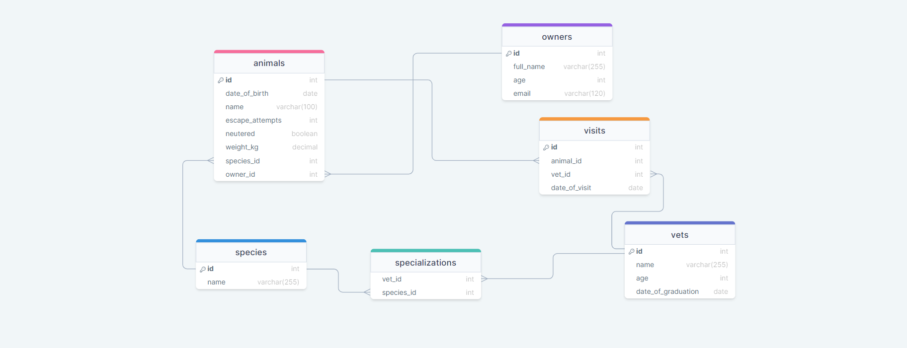

  
   

# 📗 Table of Contents

- [📖 About the Project](#vet-clinic)
  - [🛠 Built With](#built-with)
    - [Tech Stack](#tech-stack)
- [💻 Getting Started](#getting-started)
- [👥 Authors](#author)
- [🤝 Contributing](#contributing)
- [🙏 Acknowledgements](#acknowledgments)
- [📝 License](#license)

# VET CLINIC

This Project is a small management system for an animals clinic.

## 🛠 Built With 

### Tech Stack 

  <ul>
    <li><a href="https://www.postgresql.org/">Postgresql</a></li>
  </ul>

## 💻Getting Started

This repository includes files with plain SQL that can be used to recreate a database:

- Use [schema.sql](./schema.sql) to create all tables.
- Use [data.sql](./data.sql) to populate tables with sample data.
- Check [queries.sql](./queries.sql) for examples of queries that can be run on a newly created database. **Important note: this file might include queries that make changes in the database (e.g., remove records). Use them responsibly!**

### Database Schema Diagram

## Author

👤 **Dave**

- GitHub: [@DaveZag](http://github.com/daveZag)
- LinkedIn: [@Dave Zagabe](https://www.linkedin.com/in/dave-zagabe/)

## Contributing

Contributions, issues, and feature requests are welcome!

Feel free to check the [issues page](../../issues/).

## Show your support

Give a ⭐️ if you like this project!

## Acknowledgments

- Microverse

## License

This project is [MIT](./LICENSE.md) licensed.
